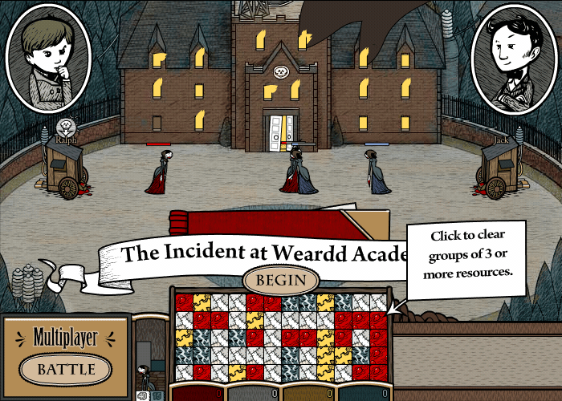

<div align="center">

# corpse-craft

A standalone build of Corpse Craft (aka PopCraft), a 2011 Whirled game whose build system, dependency manager and target runtime have all since ceased to exist.

Ant thrown out for a direct mxmlc invocation. Six dependencies pinned to 2011. Saves that go to disk instead of to a dead server. A save editor that walks the AMF3 by hand.



<!-- HOSTED: this goes live the first time the pages workflow runs against a repository with Pages enabled. Drop this comment then. -->
Play it in a browser: **https://tintando.github.io/corpse-craft/**

</div>

<br/>

## The problem

PopCraft was written by Three Rings Design for Whirled, a Flash virtual world, and its last real commit is `4166370bc`, dated 2011-04-26. The source survives on GitHub. Nothing around it does. `games/popcraft/build.xml` is a few lines of ant that import `../../../etc/project-include.xml`, a file that lived in a Subversion tree nobody has a copy of. The SWCs it expects to link against were produced by a release process that stopped running when the company folded. Flashbang, the engine the game sits on, arrived through `svn:externals`, a mechanism that leaves no trace at all in a git conversion, so the git repository does not merely lack the dependency: it lacks any record that the dependency was ever there. Then Adobe killed Flash Player, so a SWF that did build would have had nothing to run in.

The build instructions for this game are not stale. They are absent, and every thread you would pull to reconstruct them has been cut at both ends. What is left is three problems, and none of them is the one the ant file appears to be about.

- **The build system is the missing dependency.** What `build.xml` needs is not ant, it is the directory tree it expected to sit inside. Reconstructing a 2011 Subversion layout around it would be archaeology in service of nothing, so this build discards it and drives `mxmlc` directly: one shell script, six source roots on the compiler source path, one SWC on the library path, and no intermediate artefact anywhere. Nothing is prebuilt, so nothing can be missing.
- **HEAD is the wrong revision, everywhere.** The dependency repositories outlived the game that used them and kept moving for years. Aspirin's `Random` lost the seed argument that Flashbang passes it. Flashbang renamed `GameObject.destroyed()` to `cleanup()` in `c458c0c` on 2011-03-26, one month before PopCraft's last commit, so the game needs the code from after that rename and not one day of drift past it. Each dependency is pinned to a revision contemporaneous with 2011-04-26, and the table below records which one and why.
- **The game saved to a server, and the server is gone.** `UserCookieManager` gates its read and its write path behind `ClientCtx.gameCtrl.isConnected()`, a question the SDK phrases as "has someone just loaded up our SWF by itself?" In a standalone build the answer is always yes, so the game ran, played correctly, and discarded every byte of progress in silence. One of the patches here routes the cookie into a local `SharedObject` whenever there is no server to talk to, and leaves the server path exactly as it was.

This repository is the harness and the patches, not the game. PopCraft's code, its artwork and the Whirled SDK belong to Three Rings Design and Greyhavens and are not redistributed here: the quick start clones them from their own repositories and pins them, and [Licenses](#licenses) sets out what covers what.

## What it does

- **One build script, no ant and no SWCs**: `build.sh` puts all six dependency source roots on `mxmlc`'s source path and compiles the game from source in a single pass, about five seconds for both SWFs on a warm JVM
- **Relocatable by construction**: every path is derived from the script's own location, with the dependency checkouts under `deps/` or wherever `CORPSE_CRAFT_DEPS` points, so there is no absolute path anywhere in the repository
- **A preflight that names the missing thing**: each source root, `corelib.swc`, `mxmlc.jar` and `playerglobal.swc` are checked before the compiler runs, because Flex reports a missing dependency as a path that appears nowhere in the build
- **Two builds from the same source**: `PopCraft.swf` reads level XML off disk so levels can be edited without recompiling, and `PopCraft-offline.swf` uses the copies already embedded in the SWF and therefore needs no filesystem access at all
- **Local saves**: a patched `UserCookieManager` writes to a `SharedObject` when there is no Whirled server, so story progress survives quitting the game
- **A save editor**: `tools/savetool.py` parses the Local Shared Object, prints the fourteen-level table, and unlocks, re-locks or repairs it in place without disturbing the four other data sources sharing the same blob
- **Patches, not a fork**: three patch files against the upstream game checkout, applied with one `git apply`

## Quick start

You need a JDK with `java` on `PATH` (the build was verified on OpenJDK 25), `git`, `curl`, about 2.5 GB of disk, and [Ruffle](https://ruffle.rs/downloads) to run the result. The dependency checkouts dominate that figure: `whirled-projects` alone is 2.1 GB, because it holds every avatar, pet and toy ever published for Whirled, and only its `games/popcraft` directory (15 MB) is used here.

```bash
git clone https://github.com/tintando/corpse-craft
cd corpse-craft
mkdir -p deps && cd deps

git clone https://github.com/greyhavens/whirled-projects.git
git clone https://github.com/greyhavens/whirled-sdk.git
git clone https://github.com/threerings/flashbang.git
git clone https://github.com/threerings/aspirin.git
git clone https://github.com/threerings/narya.git

git -C flashbang   checkout d7bd0d5
git -C aspirin     checkout f7b61d2
git -C whirled-sdk checkout 418d4ec
```

Then the Apache Flex SDK, and Adobe's `playerglobal.swc` separately, because it is not in the SDK tarball and never was:

```bash
curl -LO https://archive.apache.org/dist/flex/4.16.1/binaries/apache-flex-sdk-4.16.1-bin.tar.gz
mkdir flexsdk && tar xzf apache-flex-sdk-4.16.1-bin.tar.gz -C flexsdk --strip-components=1

mkdir -p flexsdk/frameworks/libs/player/32.0
curl -L -o flexsdk/frameworks/libs/player/32.0/playerglobal.swc \
    https://fpdownload.macromedia.com/get/flashplayer/updaters/32/playerglobal32_0.swc
```

Then the three patches, and the build:

```bash
cd ..
git -C deps/whirled-projects apply "$PWD"/patches/*.patch

./build.sh              # both SWFs
./build.sh standalone   # bin/PopCraft.swf only
./build.sh offline      # bin/PopCraft-offline.swf only
```

```
$ ./build.sh both
==> syncing levels from <repo>/deps/whirled-projects/games/popcraft/levels
==> building PopCraft.swf from PopCraft_Standalone.as
Loading configuration file <repo>/deps/flexsdk/frameworks/flex-config.xml
<repo>/bin/PopCraft.swf (6240376 bytes)
==> building PopCraft-offline.swf from PopCraft_Offline.as
Loading configuration file <repo>/deps/flexsdk/frameworks/flex-config.xml
<repo>/bin/PopCraft-offline.swf (6240435 bytes)
```

The build is not bit-reproducible: `mxmlc` stamps the SWF, so the byte count wanders by a few across runs. Expect roughly 6.24 MB each, and do not treat a changed size as a changed build.

### Getting Ruffle

Ruffle is not vendored here. It is permissively licensed (Apache-2.0 or MIT) so there would be nothing wrong with shipping it, but it is a 33 MB platform-specific binary in a repository that is otherwise a few tens of kilobytes of text, git would keep every version of it forever, and it would be stale within weeks of any commit. Install it from [ruffle.rs/downloads](https://ruffle.rs/downloads), from Flathub as `rs.ruffle.Ruffle`, or from your distribution.

Ruffle is an emulator under active development, and its compatibility moves in both directions, so it is worth recording exactly which build this game was last verified against:

```
Ruffle 0.5.0-stable (a4f5b5256e245693bc9077ef6c6b6abc95490e7f 2026-08-03)
linux-x86_64, sha256 3a2397a183a2045a3b7c07a86d651c3ac398781459550875dc5a0a7922228c62
```

If a newer Ruffle renders PopCraft wrongly, that is the build to fall back to, and it is the one the GIF at the top of this page was captured from.

### Running it

```bash
cd bin
ruffle --filesystem-access-mode deny PopCraft-offline.swf
```

The offline build asks the filesystem for nothing, so `deny` is the right setting and Ruffle never prompts. `PopCraft.swf` reads `../levels` at runtime and needs `--filesystem-access-mode allow` instead, which costs you a permission prompt on every launch. That is the whole reason the offline build exists.

### Running it in a browser

Ruffle has a WebAssembly build as well as a desktop one, and the offline SWF is exactly the shape it wants: levels embedded, nothing asked of the filesystem, nothing asked of the network. `web/index.html` is the whole player page, and `.github/workflows/pages.yaml` builds the SWF, fetches a pinned Ruffle web build, assembles the two into a site and deploys it to GitHub Pages on every push to `main`. Nothing compiled and nothing emulated is committed to this repository: both are fetched or built in the runner.

To try the same page locally, build the offline SWF, put a Ruffle web build beside it and serve the directory. Opening `index.html` from `file://` will not work, because the browser refuses to fetch WebAssembly across that origin:

```bash
./build.sh offline
mkdir -p site/ruffle && cp web/index.html bin/PopCraft-offline.swf site/
curl -fsSLO https://github.com/ruffle-rs/ruffle/releases/download/v0.6.0/ruffle-0.6.0-web-selfhosted.zip
unzip -q ruffle-0.6.0-web-selfhosted.zip -d site/ruffle

python3 -m http.server -d site 8000    # then open http://localhost:8000/
```

## How it works

### Dependency pinning

PopCraft's last real commit is `4166370bc` (2011-04-26, *"Fix for latest Flashbang"*), and every dependency is pinned to a revision contemporaneous with that date. HEAD of these repositories has drifted far enough to break the build.

| repo | revision | date | why this one |
|---|---|---|---|
| `threerings/flashbang` | `d7bd0d5` | 2011-04-26 | `GameObject.destroyed()` became `cleanup()` in `c458c0c` (2011-03-26); PopCraft postdates the rename, so it needs a revision after it and close to it |
| `threerings/aspirin` | `f7b61d2` | 2011-04-25 | HEAD's `Random` takes no seed argument; this revision matches the call Flashbang makes |
| `greyhavens/whirled-sdk` | `418d4ec` | 2011-06-28 | the tip of the default branch, which has not moved since; pinned anyway so a revived repository cannot surprise the build |
| `greyhavens/whirled-projects` | default branch | – | the game itself. The patches are generated against the tip, `83fa8a94a` |
| `threerings/narya` | any recent | – | only `aslib/src/main/as/com/threerings/util/Integer.as` is used, and that file is stable |

Flashbang and aspirin end up in detached HEAD at those revisions, which is correct and is not a mistake to clean up. Running `git checkout master` in either will break the build.

Two sourcing facts that cost real time to establish:

- **`com.threerings.util.Integer` has never existed in aspirin.** It lives in narya's `aslib`, which is the only reason narya is a dependency at all. Narya's `com/threerings/util` directory has zero filename overlap with aspirin's, so both source roots sit on the compiler's source path together without either shadowing the other.
- **`greyhavens/whirled` is a dead link.** The `../../../` root that `build.xml` reaches for is `greyhavens/whirled-sdk`, under a name it no longer goes by.

### The playerglobal trap

`playerglobal.swc` is the hardest single file to obtain in this whole exercise. Most Adobe URLs went dead or started returning 403 after Flash end-of-life, and it has never been on Maven Central. The one surviving URL is the one the quick start uses, found by reading Apache's own installer manifest at `https://flex.apache.org/installer/sdk-installer-config-4.0.xml`. It belongs at `frameworks/libs/player/32.0/playerglobal.swc` and is 472260 bytes.

Getting the file is half of it. Telling `mxmlc` where it is turns out to be the other half, because `frameworks/flex-config.xml` reaches for it through a `{playerglobalHome}` token in two separate places, on the external library path and again on the library path, and that token resolves from fewer sources than it looks like it should:

- The `PLAYERGLOBAL_HOME` environment variable works. `build.sh` exports it.
- The `+playerglobalHome=` command-line form is accepted without complaint and then ignored. The giveaway is the error message, which quotes the token back at you unexpanded: `Error: unable to open '{playerglobalHome}/32.0/playerglobal.swc'`.
- An `env.properties` file in the SDK root **outranks the environment variable**, silently. If the SDK you unpacked has one, or you made one once and forgot, that is the value the compiler uses, and the error names a path that appears nowhere in this build. `build.sh` checks for exactly this case in preflight and fails with the fix rather than letting Flex report it.

That last one is not hypothetical: it is how this build broke when the tree was moved, and it is why the preflight exists.

### The three patches

The game checkout is otherwise stock. Everything in `patches/` applies to `games/popcraft/src/popcraft/`.

**`01-keyboardevent-import-typo.patch`.** A one-line repo typo: `import flash.event.KeyboardEvent` should be `flash.events`. The file compiles right up to line 262, where `onKeyDown` names the type it failed to import. `git log -S` places the typo's arrival in `4166370bc` itself, the last real commit the game ever received, so the change that broke the build is the change the history ends on, and nobody has compiled this since the day it was written.

**`02-local-save-support.patch`.** The save fix described above, plus the part that took a session to find. `readLocalCookie()` returns a **copy** of the stored `ByteArray`, never the `SharedObject`'s own instance, because `completeLoadData()` calls `ba.uncompress()` and that mutates in place. Hand out the stored instance and the `SharedObject` is left holding uncompressed bytes, which a clean shutdown flushes back to disk; the next launch throws on `uncompress()`, every data source calls `cookieReadFailed()` and resets itself, and the save is gone. This happened: a 27-minute session wrote a 302-byte uncompressed save that would have wiped itself on the next load. The copy prevents it, and a recovery branch recompresses any save left in that state by an earlier build rather than discarding the player's progress.

The SDK's `LoopbackGameControl` is not an alternative here. Its cookie store is an in-memory `Map` (`LoopbackGameControl.as:1365`), so it survives a mode change and not an exit.

**`03-offline-entry-point.patch`.** A new twenty-two-line class, `PopCraft_Offline`, subclassing `PopCraft_Standalone` and setting `Constants.DEBUG_LOAD_LEVELS_FROM_DISK = false`. It works because AS3 runs the implicit `super()` before the subclass constructor body, so the subclass overrides what the parent has just set. `game/story/LevelManager.as:275` and `game/endless/EndlessLevelManager.as:221` both hardcode `LEVELS_DIR = "../levels"`, which is what forces `bin/` to have a sibling `levels/` in the on-disk build and what the embedded build sidesteps entirely.

Level XML is game data rather than build output, so it is not kept in this repository. `build.sh` copies it out of the game checkout into `levels/` whenever it builds the standalone target.

### Save data

Ruffle stores the `SharedObject` under `--save-directory` (by default `~/.local/share/ruffle/SharedObjects`), in a directory that mirrors the **full path of the SWF that wrote it**:

```
~/.local/share/ruffle/SharedObjects/localhost/<absolute path to>/bin/PopCraft-offline.swf/popcraft.sol
```

Two consequences follow from the key including the filename. `PopCraft.swf` and `PopCraft-offline.swf` keep entirely separate saves. And moving or renaming a SWF orphans its save, so relocating the tree means moving the matching directory under `SharedObjects/localhost/` to match. Deleting the `.sol` resets progress.

Saving is unrelated to `--filesystem-access-mode`. That flag gates the AS3 file APIs, not `SharedObject` storage, so `deny` does not prevent the game from saving.

In a browser the same `SharedObject.getLocal("popcraft")` call lands in `localStorage` instead of in a file, keyed on the address the SWF was served from. Progress survives closing the tab, and survives a redeploy as long as the SWF keeps its filename and its place at the root of the site, which is the reason the Pages workflow puts it there and leaves it there. It does not travel between the two: a desktop save is a `.sol` on disk, a browser save is a `localStorage` entry, and `savetool.py` reads only the first. Clearing site data resets the game and a private window forgets it on close. If the browser refuses the write, `writeLocalCookie()` gets a flush status other than `FLUSHED` and the game logs a warning to the console and carries on, so a player in a private window is never told on screen that nothing is being kept.

## Editing the save

`tools/savetool.py` reads and edits the Local Shared Object directly, with no dependencies beyond the standard library.

```
$ tools/savetool.py show
/home/.../PopCraft-offline.swf/popcraft.sol
cookie version 3, 261 bytes

 lvl  unlocked  expert  score
   1     True    False       0
   2     False   False       0
   3     False   False       0
...
  14     False   False       0
```

```bash
tools/savetool.py unlock                    # unlock all 14 story levels
tools/savetool.py lock                      # back to level 1 only
tools/savetool.py repair                    # rewrite compressed, changing nothing else
tools/savetool.py --swf PopCraft.swf show   # the other build's save
```

Only the fourteen `LevelRecord`s at bytes 2 to 86 are rewritten. The 175 bytes belonging to `PlayerStats`, `EndlessLevelManager`, `PrizeManager` and `SavedPlayerBits` are spliced through untouched. `unlock` sets `unlocked` alone and leaves `expert` and `score` where they were, so levels become selectable without being marked as beaten; the game's own `MainMenuMode.unlockLevels()` sets `score = 1` as well, which it does not need to, since availability keys solely on `unlocked` at `MainMenuMode.as:405`.

**Quit the game before editing.** It rewrites the save on its exit paths and will clobber an edit made under it.

Three traps are worth knowing, because each one fails silently:

- **Compress with zlib level 9.** That is what AS3's `ByteArray.compress()` emits (header `78 da`). A level-6 stream (`78 9c`) is byte-for-byte valid zlib of the same content, and Ruffle's `uncompress()` rejects it here anyway. Nothing says so: `completeLoadData()` logs a warning nobody sees, every data source resets itself, and the game rewrites the save over the top. The edit evaporates.
- **A rewritten save is the failure signal.** If the file's checksum changes across a launch, the cookie was rejected and reset; if it is untouched, the read succeeded. That is the cheapest way to verify an edit without playing through. One caveat: killing Ruffle with `SIGTERM` skips its shutdown flush, so a `timeout`-based test can only ever prove that the read succeeded, never that the write path is sound.
- **The `ByteArray`'s AMF3 length is a U29**, one to four bytes wide, and it cannot be located by scanning backwards from the payload, because a multi-byte U29's final byte has its high bit clear exactly like a single-byte one does. `parse()` therefore records where the length starts rather than inferring it. Getting this wrong leaves a stray leading byte that inflates the declared length; zlib still decodes, since its streams are self-terminating, so the file looks intact to a reader while Ruffle hits EOF and drops the save. `savetool.py` rejects a declared length longer than the bytes that remain.

The game does have a built-in "Unlock levels" button at `MainMenuMode.as:267`, behind `Constants.DEBUG_ALLOW_CHEATS`, which is `false`. Flipping that constant and rebuilding is the alternative to editing the save.

## Testing

There are no automated tests, and CI is a lint and syntax gate on every file this repository owns: `shellcheck build.sh`, `ruff check tools/`, `python -m py_compile tools/savetool.py`, and `git apply --stat patches/*.patch` to prove the patches still parse. That last one matters more than it sounds: a truncated or rewrapped hunk header is invisible to a reader and fatal to `git apply`, and the patches are the part of this repository most likely to rot.

The build gate lives in the Pages workflow rather than in `ci.yaml`. Every push to `main` assembles the dependency tree in the runner, applies the patches, compiles the offline SWF and deploys it, so a change that stops the thing compiling cannot reach the published site. It is not cheap, which is why it is separate: whirled-projects alone is 2.1 GB, so its checkout is a blobless partial clone sparse to `games/popcraft`, and the whole `deps` tree is cached against the pinned revisions and refetched only when one of them moves. The lint gate stays in `ci.yaml` because it answers in seconds and this one does not. Locally, `./build.sh` is still the test, and it takes about five seconds once the dependencies are on disk.

The build harness is verified by use rather than by assertion: the SWF in the screen capture at the top of this page was compiled by the `build.sh` in this repository, from the pinned revisions in the table above, and recorded running under Ruffle 0.5.0 on Linux x86_64.

## Scope and known gaps

- **Multiplayer does not work and cannot.** The menu's Multiplayer button calls `ClientCtx.showMultiplayerLobby()`, which is a no-op when `gameCtrl.isConnected()` is false, and in a standalone SWF it always is. The button is still there, and it does nothing. Making it work would mean reimplementing the Whirled game server, which is a different project.
- **What survives is the single-player game.** Fourteen story levels and single-player endless mode, which is most of PopCraft and not all of it: the multiplayer endless variant shares the lobby's fate.
- **The quick start is Linux-flavoured.** The build itself is pure Java and should run anywhere `mxmlc` does, but the Ruffle invocation, the save paths and the capture notes all assume Linux, and only Linux x86_64 has been exercised.
- **`playerglobal.swc` hangs off one URL.** If `fpdownload.macromedia.com` ever stops serving it, this build needs a new source for a file Adobe no longer distributes anywhere else. Keep a copy.
- **No compiled output and no Ruffle binary are shipped here.** The SWFs are excluded because they are not redistributable, Ruffle because a 33 MB third-party binary does not belong in a 40 KB repository, and [Licenses](#licenses) sets out both arguments. Everything needed to obtain them is in the quick start.
- **The save editor knows one cookie version.** It assumes version 3 and the fourteen-record layout that `UserCookieManager` writes, and it does not validate the version before rewriting. There has only ever been one shipping version, so this has not mattered.
- **The patches are unified diffs, not a fork.** They apply to the upstream tip today. If `greyhavens/whirled-projects` ever moves, they will need refreshing, which is what the CI parse gate is there to make noisy rather than silent.

## Repository map

```
corpse-craft/
├── build.sh                 # the whole build: preflight, level sync, two mxmlc invocations
├── patches/
│   ├── 01-keyboardevent-import-typo.patch   # flash.event -> flash.events
│   ├── 02-local-save-support.patch          # SharedObject saves when there is no server
│   └── 03-offline-entry-point.patch         # PopCraft_Offline, levels embedded
├── tools/
│   └── savetool.py          # read and edit the Local Shared Object
├── web/
│   └── index.html           # the browser player, deployed to Pages by the workflow
├── docs/media/              # hero.gif and the shot list that produced it
├── deps/                    # not in git: the six checkouts the quick start makes
├── bin/                     # not in git: build output
└── levels/                  # not in git: copied from the game checkout by build.sh
```

## Built with

Bash and Python's standard library, which is the entire dependency list on this side of the line. The compiler is `mxmlc` from the Apache Flex SDK 4.16.1, driven as a jar rather than through ant, `compc` or any IDE; the runtime is Ruffle, an Adobe Flash Player emulator written in Rust, standing in for a plugin that no longer exists for any browser. There is no package manager anywhere in this project, which is less a design choice than a description of 2011.

## Acknowledgements

PopCraft was made by Three Rings Design, and the Whirled SDK, narya, aspirin and flashbang are theirs too. Greyhavens put the source on GitHub after Whirled shut down, which is the only reason any of this was possible; a build system is a recoverable loss, and source is not.

[Ruffle](https://ruffle.rs) is what makes the result playable rather than merely compilable, and it deserves the larger share of the credit: this project reassembles a SWF, and Ruffle is the part that runs it.

## Licenses

Several, because almost none of this is one person's work. The short version: what is in this repository is MIT, and everything the build reaches for is someone else's under its own terms.

- **This repository**, meaning `build.sh`, `tools/savetool.py`, the patches and the documentation: MIT, [`LICENSE`](LICENSE).
- **PopCraft itself**, its ActionScript and its artwork and audio: Three Rings Design / Greyhavens. `greyhavens/whirled-projects` carries **no license file and no copyright headers**, so no redistribution rights are granted by it. It is public to read and to clone; that is not the same as a license. None of it is redistributed here, and the patches quote only the handful of lines of context a unified diff needs in order to apply.
- **The Whirled SDK** (`greyhavens/whirled-sdk`): mixed, and the restrictive part is the larger part. 131 of the 147 ActionScript files under `libraries/whirled/` carry `Copyright (c) 2007-2009 Three Rings Design, Inc. Please do not redistribute.` Eight are LGPL-3.0 third-party code (the `deng.fzip` ZIP library by Claus Wahlers and Max Herkender, and work by David Chang). Everything under `contrib/` is LGPL-3.0, with `COPYING` and `COPYING.LESSER` at `contrib/` and per-file headers naming Three Rings, Keith Irwin and J Daniels. `lib/corelib.swc` is a prebuilt binary of Adobe's as3corelib, shipped with no license text of its own in that tree.
- **flashbang** and **aspirin** (`threerings/*`): LGPL-3.0, full text at `LICENSE` and `COPYING` in their respective repositories.
- **narya** (`threerings/narya`): LGPL-2.1, full text at `LICENSE`.
- **Apache Flex SDK 4.16.1**: Apache-2.0, with `LICENSE` and `NOTICE` in the tarball. Adobe's `playerglobal.swc` is not part of it, is not Apache-licensed, and carries Adobe's own redistribution terms, which is precisely why the SDK makes you fetch it separately.
- **Ruffle**: Apache-2.0 or MIT, at your option. A release tarball carries the full text, including its dependencies' licenses, as `LICENSE.md`.

Two consequences of the above are worth stating plainly rather than leaving for a reader to derive.

**The compiled SWFs are not redistributable, so they are not here.** A finished `PopCraft.swf` statically contains PopCraft's compiled ActionScript, its embedded artwork and audio, Whirled SDK code that asks in its own header not to be redistributed, and LGPL-3.0 and LGPL-2.1 libraries linked in. The first two have no license permitting redistribution at all, and that alone settles it; the LGPL components would bring conveying obligations of their own even if they did not. Building the SWF yourself from sources you fetched yourself is a different act, and it is the one this repository is for.

**Ruffle is absent for a milder reason.** Its license permits redistribution freely. It is left out because a 33 MB platform-specific binary does not belong in a repository whose own source is smaller than a photograph, and because it goes stale the moment upstream cuts a release. Install it from [ruffle.rs](https://ruffle.rs/downloads) instead.
